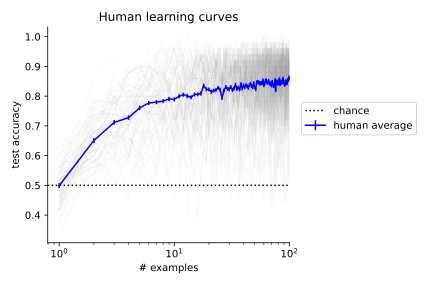

from hobj.learning_models import random_guesser

# `hobj`: human object learning benchmarks

[](https://github.com/himjl/hobj/actions/workflows/ci.yml)

This repository contains benchmarks for comparing models of object learning against measurements of human behavior, from Lee and DiCarlo 2023 (["How well do rudimentary plasticity rules predict adult visual object learning?"](https://journals.plos.org/ploscompbiol/article?id=10.1371/journal.pcbi.1011713)). It also lets you download the raw data and images from the experiments in the paper.

<div style="text-align: center;">
  
</div>


## Quickstart

### Install

The `hobj` package works for Python >=3.12. After cloning this repository on your machine, navigate to this directory in your shell and run:

``` pip install -e .```

### Using `hobj` to comparing a linear learner against human learning data 

The template script below shows you how you can run a benchmark on a linear learning model based on your image encoding model. 

All you need to do is have a way to process a `PIL.Image` into a vector of image features (as an `np.ndarray`). There are ~18,000 images that you'd need to compute image features for.    

```python
import hobj
import numpy as np 

# Compute your features for the images 
my_image_features: dict[str, np.ndarray] = {}
for image_id in hobj.list_image_ids():
    image = hobj.load_image(image_id=image_id) # PIL.Image
    
    # Compute your features here:  
    my_image_features[image_id] = ... # replace right hand side with your image-computable model

# Assemble the learning model:
model = hobj.create_linear_learner(
    image_id_to_features=my_image_features,
    update_rule_name='Square', # "Square", "Perceptron", "Hinge", "MAE", "Exponential", "CE", "REINFORCE",
    alpha=1, # learning rate between [0, 1]
)

# Load the benchmark:
benchmark = hobj.MutatorHighVarBenchmark()  # or hobj.MutatorOneshotBenchmark()

# Score the model:
result = benchmark.score_model(model)

# Print its score and its CI:
print(result.msen, result.msen_CI95)

# You can also check out more granular statistics of the model's behavior, like its learning curves: 
# print(result.model_statistics)
```

Note that on first use, the packaged dataset is downloaded automatically into `./data`.
To use a different location, pass `cachedir=...` to a data loader or benchmark
constructor, or prefetch manually with `hobj-download-data --cachedir /path/to/data`.

For more details (e.g., how to load the raw behavioral data or images), check out the Jupyter notebooks in `examples/`.

### Need help or have questions?

Please don't hesitate to send me an email ([mil@mit.edu](mailto:name@example.com)), or open an issue on this repo!


## Citation

```
@article{lee2023well,
  title={How well do rudimentary plasticity rules predict adult visual object learning?},
  author={Lee, Michael J and DiCarlo, James J},
  journal={PLOS Computational Biology},
  volume={19},
  number={12},
  pages={e1011713},
  year={2023},
  publisher={Public Library of Science San Francisco, CA USA}
}
```


## Changes to codebase since publication
This codebase was refactored in 2026 to improve the accessibility, performance, and quality of the code. Along the way, minor changes to the statistical analysis of the original codebase were introduced (see [changelist](site/changelist.md)). To see the codebase at the time of publication, check out the repo with the `v1` tag [here](https://github.com/himjl/hobj/releases/tag/v1).
